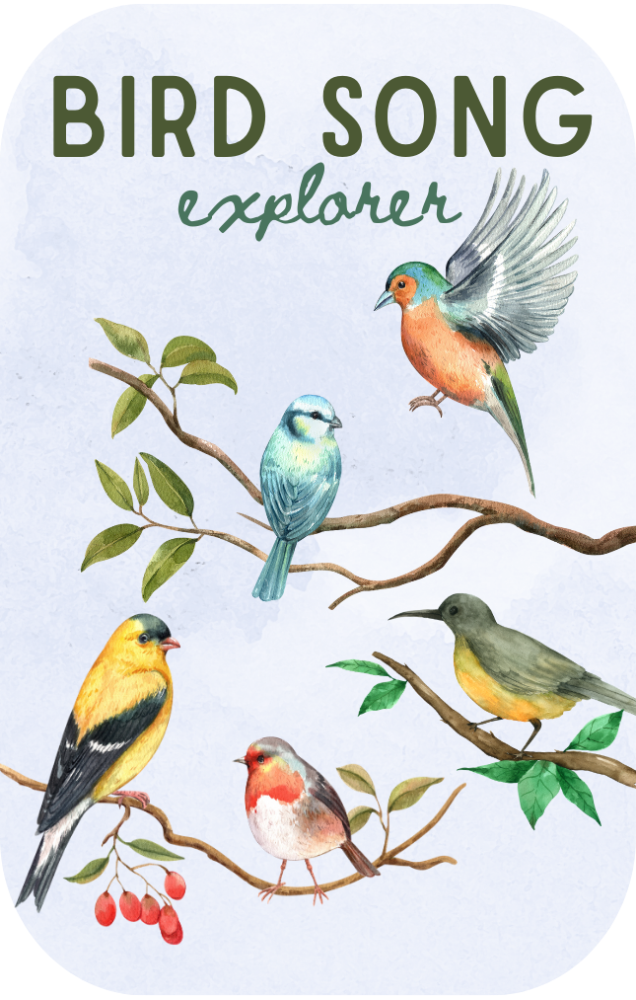

# Bird Song Explorer 

> A smart Yoto card that brings local birds to your child's speaker every day. Wake up to the actual birds singing in your neighborhood, learn fun facts, and develop a connection with nature—all through the magic of a Yoto card.

## What It Does

This Yoto card automatically updates with a new bird from around the world. You will hear:

### Track Structure
1. **Welcome, Explorers!** - A warm welcome with genuine bird sounds softly playing in the background
2. **Who's Singing Today?** - Announcement of the featured bird
4. **Bird Explorer's Guide** - Fun, educational facts about the bird (for kids and adults!)
5. **See You Tomorrow!** - A playful outro with jokes, fun facts, or a challenge tailored for young explorers

## For Developers

Built in Go, deployed on Google Cloud Run, scheduled with Cloud Scheduler. The system combines the following technology to create a seamless experience:

### Tech Stack
- **Language**: Go 1.21+ with modular service architecture
- **Deployment**: Google Cloud Run (serverless container platform)
- **Scheduling**: Cloud Scheduler for regular, automatic updates
- **Location Detection**: IP geolocation with device timezone fallback
- **Educational Content**: Sourced from trusted organizations, such as Cornell Lab of Ornithology 
- **Narration**: Recorded, edited, and mixed by me (and occasionally my kids too! credit: Archer, age 5 & Otto, age 3)
- **Platform Integration**: Yoto API for MYO card updates

## License

MIT - Feel free to adapt this for your own Yoto adventures! 

---

*Built with love for young explorers and their Yoto players. May every morning bring the wonder of nature to your home.* 🐦
